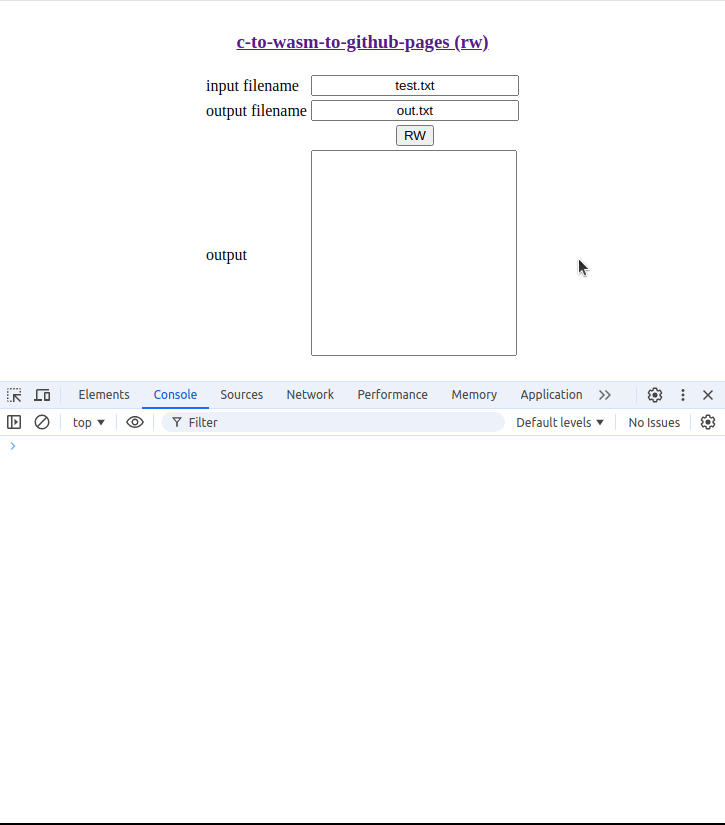

# c-to-wasm-to-github-pages (rw)

This is another minimal example of file read/write using emscripten with an
embedded file.

Locally built and tested on Ubuntu 22.04 LTS.

## Demo

## Build and run locally

- Set up [emsdk](https://emscripten.org/docs/getting_started/downloads.html)
- Clone this repo
- Run: `emmake make serve-wasm`
- Open URL <http://localhost:8080/> in browser
